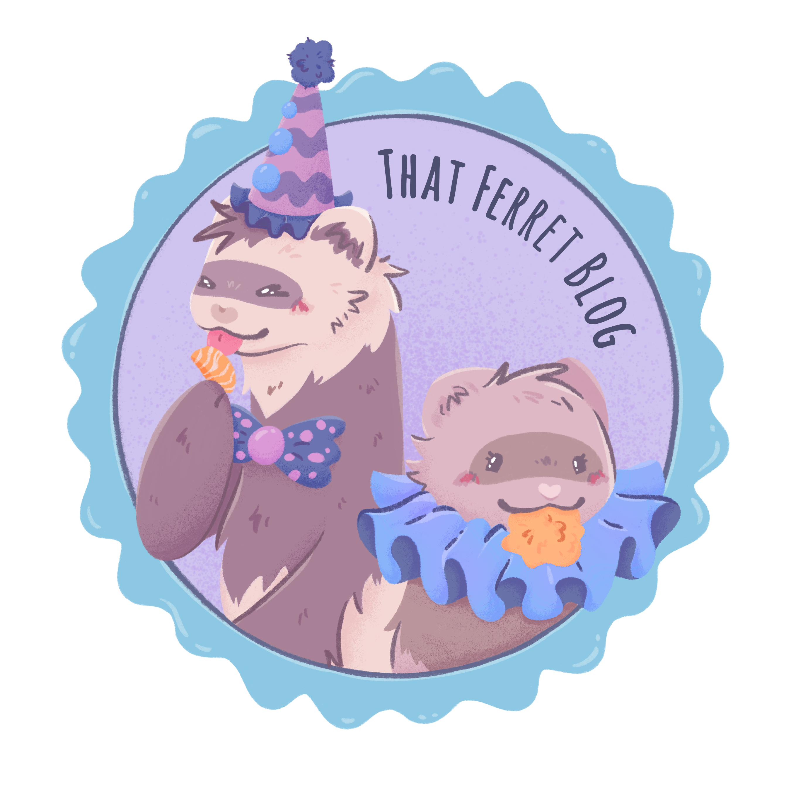

<h1 align="center">
   
  <a href=""https://thatferret.blog>That Ferret Blog</a>
</h1>

A blog for my partner and I to provide information, sources, overviews, & opinions for all things ferret related. 

---

### Licence

This repo is licensed under the [MIT License](LICENSE) 
(With exceptions noted below.)

This does not necessarily extend to any upstream components. 
Other components or software not listed in this readme may also be included, such components may have individual licenses.
Where apropriate, licenses and/or readmes for other components may be included at the root directory of that component.

The post/page content of [That Ferret Blog](https://thatferret.blog/) © 2025 by [Bunny](https://linktr.ee/thatbunny) & [GiggleSquid](https://github.com/GiggleSquid) is licensed under [CC BY-NC-SA 4.0](https://creativecommons.org/licenses/by-nc-sa/4.0/).

[That Ferret Blog logo](assets/images/thatferretblog-logo.png) © 2025 All Rights Reserved [Bunny](https://linktr.ee/thatbunny) & [GiggleSquid](https://github.com/GiggleSquid).
Designed by the wonderful [ilustraliine](https://www.instagram.com/ilustraliine)
