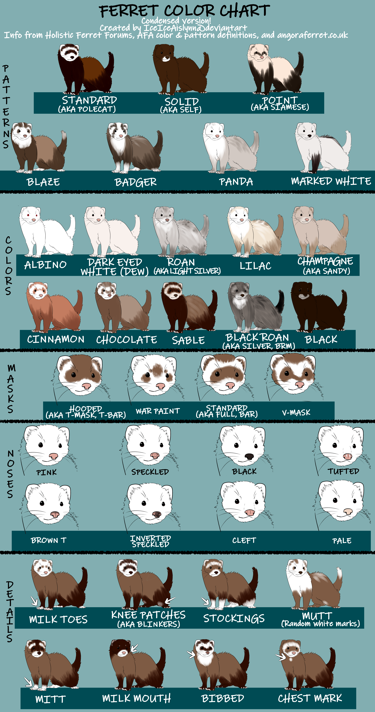

Here's a super simple post on ferret colours and patterns! It will include ferret colours, patterns, markings, mask specifics and nose colours.

Before diving into ferret colours, there are a couple of definitions. These will help you determine your ferrets' colour & pattern.

---

Undercoat
: The general under-fur of the ferret. Gives ferrets their overall colour appearance.

Guard hairs
: The very top/tips of the ferret fur.

Masks
: The mark around the ferret's eyes.

---

## Ferret Colours

Albino
: Albino ferrets lack colour pigmentation, meaning they appear all white. If ferrets have any coloured fur including guard hairs, or dark eyes, they are not considered Albino. Albino ferrets will have bright red eyes. This is due to a lack of colour pigmentation, it is not the colour red. Albino ferrets may also have a faint yellow colour due to the secreting of skin oils.

Silver/Roan
: Silver ferrets will have 50% or more guard hairs, which are white. Usually, silver ferrets will gain more white hairs every time they shed. This is often called 'roaning out' until they become a DEW (Dark-eyed white).

Dark-eyed white (DEW)
: DEW ferrets appear white all over. Similar to Albino ferrets, they may also have a yellow hue due to oils. The main difference is DEW ferrets will have dark eyes.

Black
: Black ferrets have dark black fur. There are many varieties of black ferrets based on patterns and markings. Black ferrets may be solid or partially black.

Champagne/Sandy
: Most commonly known as Sandy ferrets, these ferrets have tan-appearing legs and tails and a light cream to white undercoat. Sandy ferrets will have bronze/brown guard hairs, vary in eye colours but will often have a pink nose. Sandy ferrets masks and coats may become faint during summer.

Chocolate
: Chocolate ferrets come in all patterns and markings. Known for their chocolate-coloured medium-brown to dark-brown coats. They may sometimes have lighter-appearing guard hairs. In the US, many ferrets labelled as 'Cinnamon', especially those from Marshalls, are in fact chocolate.

Cinnamon
: Cinnamon ferrets are VERY rare. They are a variation of Champagne/Sandy ferrets with a prominent red hue.

Sable/Polecat
: Typically, the most common ferret colour. Sables are a dark colour with a cream-beige undercoat. This varies depending on the individual ferret and the season.

---

## Ferret Patterns

Blaze
: The Blaze pattern is not present in white ferrets. It is defined as a long stripe on top of the head that runs down the back of the ferret.

Mutt
: Mutt patterns consist of spots, splotches, roaning and other patterns. Typically, ferrets which are Mutt are multiple colours and do not have any distinct patterns or markings.

Panda
: The Panda pattern is not present in white ferrets. Panda ferrets have almost fully white heads, with darker patches around the shoulders and hips. They will usually not have a mask but instead have small rings of colour around the eyes and ears (like Pandas!)

Solid
: Also not present in white ferrets. True solid ferrets will have no white hairs, including no white guard hairs.

Standard
: Similar to the solid pattern. Standard patterns may have white guard hairs. Their overall colours are less concentrated and other markings may be present.

Patterned/Stripe
: Appears in all colours except for white. Patterned ferrets will typically have white guard hairs, coloured spots or patches and a stripe going down their backs.

Mitt
: The Mitt pattern is not present in white ferrets. Mitt ferrets will have white Mitt markings on the feet and Bib markings.

Point
: Also not present in white ferrets, but will be present in all other colours. Point ferrets will have an obvious difference between their coat colour and different points. The points can be present on the shoulders, legs, and tail in addition to their mask.

Roaning
: Roaning is mainly seen in Silver/Roan ferrets but can appear in other colours except white. Roaning ferrets will have 40-60% of their guard hairs white, giving it a 'salt & pepper' effect.

---

## Ferret Markings/Details

Bib
: A patch under their neck, giving the ferret the appearance of wearing a Bib.

Mutt
: Random appearing white marks.

Milk Mouth
: A white circular patch around the ferret's mouth.

Milk Toes
: White markings on the tip or entirety of the ferret's toes. These marks will not extend past the feet.

Mitt
: White markings on the ferret's feet, which extend to the ankles.

Stocking
: Similar to mitts, but the white marks will extend partially-fully up the leg.

Points
: White or coloured markings on the shoulders, legs, tail, and mask.

Other
: Other markings can range from patches on the back, tail, knees, shoulders, or chest.

---

## Ferret Masks

Standard/Full
: A solid and prominent band around and between both eyes. A classic mask appearance.

T bar
: A solid band around and in between both eyes and extended to the top of the head. The T bar would resemble an upside-down letter 'T'.

V Mask
: A thinner band which extends down to the nose. Resembles the letter 'V'.

Warpaint
: No apparent mask but can have patches of colour around the eyes. Common in silver and panda ferrets.

---

## Ferret Nose Colours/Markings

Pink
: A full pink nose.

Black
: A full dark-black nose.

Pale
: A pale off-pink/cream-coloured nose.

Cleft
: A nose which folds on both sides, usually most apparent in Angora ferrets.

Tuffed
: Only appears on Cleft noses. Tuffed refers to noses which have extended/patches of fur on them.

Dotted
: Noses that are typically pink/pale with a singular dot on them.

Speckled
: Noses that are typically pink/pale with multiple dots on them, giving them a speckled effect.

Inverted Speckled
: Noses which are the opposite of Speckled. Noses are often brown-black with lighter dots on them.

Brown T
: Noses which are pink with a brown 'T' letter resemblance on them.

---

Here's a fantastic chart by [IceIceAislynn on deviantart](https://www.deviantart.com/iceiceaislynn/)

---

This blog post was based on research from multiple sources, condensing info to make it easier to skim!

Sources: 
[fairoakferrets.co.uk/ferret-colours](https://www.fairoakferrets.co.uk/ferret-colours) 
[https://ferret.org/pdfs/Ferret_Colors_and_Patterns.pdf](https://www.ferret.org/pdfs/Ferret_Colors_and_Patterns.pdf) 
[https://holisticferretforum.com/about-ferrets/ferret-colors-and-patterns](https://holisticferretforum.com/about-ferrets/ferret-colors-and-patterns)
